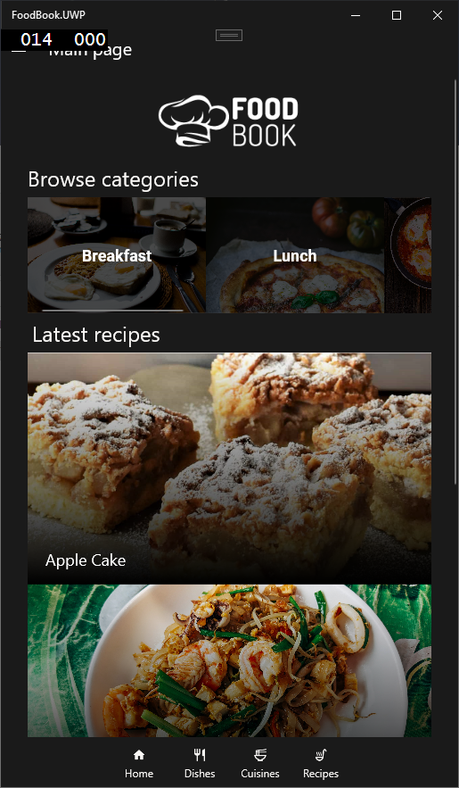
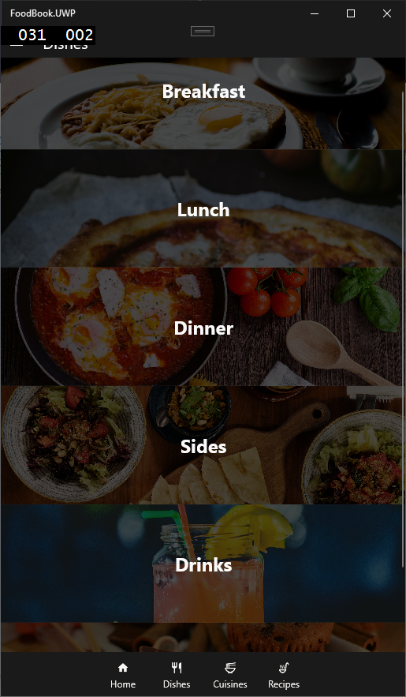
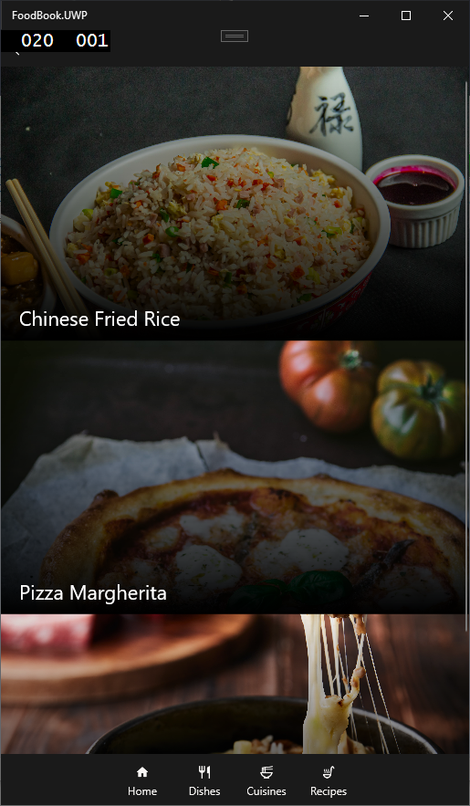
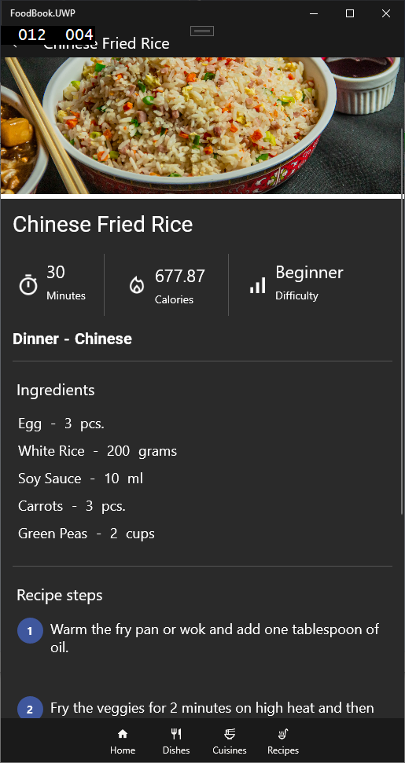
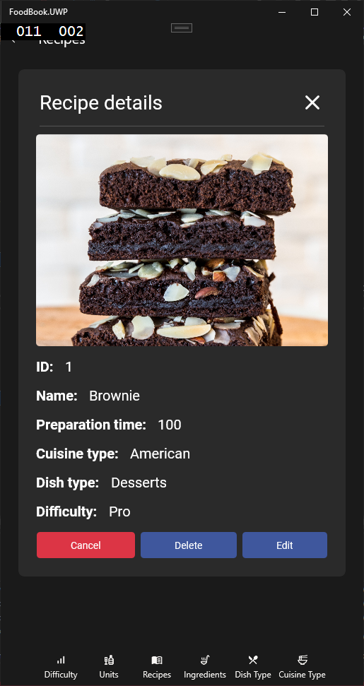
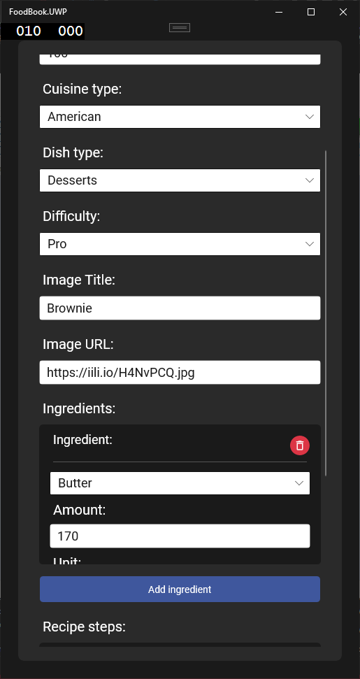

# FoodBook
"FoodBook" aplikacja mobilna służąca jako spis przepisów kulinarnych, stworzona na potrzeby projektu szkolnego.

Projekt składa się z dwóch aplikacji:
- Foodbook - aplikacja mobilna stworzona za pomocą Xamarina
- FoodbookApi - aplikacja internetowa stworzona za pomocą ASP.NET oraz Swagger, która pełni rolę RestApi dla aplikacji.

## Wykorzystane technologie:

**Frontend**
- XAML

**Backend**
- C#
- Xamarin
- Entity Framework
- ASP.NET

## Opis aplikacji:

**Funkcje aplikacji:**
- Przeglądanie przepisów
- Filtrowanie przepisów za pomocą kategorii
- Zarządzanie danymi w aplikacji (CRUD dla pracownika)

## Wygląd aplikacji:

    

Obraz 1. Główna strona aplikacji.

----

    

Obraz 2. Kategoria - dania.

----

    

Obraz 3. Przepisy

----

    

Obraz 4. Szczegóły danego przepisu.

----

    

Obraz 5. Szczegóły przepisu dla pracownika

----

    

Obraz 6. Edycja przepisu dla pracownika

